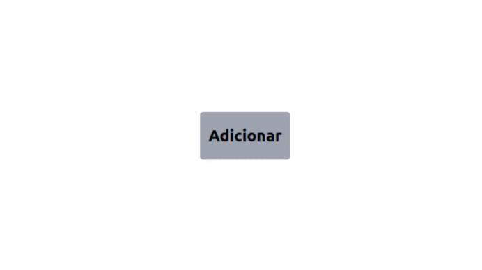

<h1 align="center">Tailwind hover pop-up e Tooltip</h1>

<h3 align="center">https://brunocabralsilva.github.io/tailwind-hover-tooltip/</h3>

<h4>Projeto criado para praticar a criação de pop-pups e tooltips com o uso do Tailwind CSS e Flowbite.</h4>

